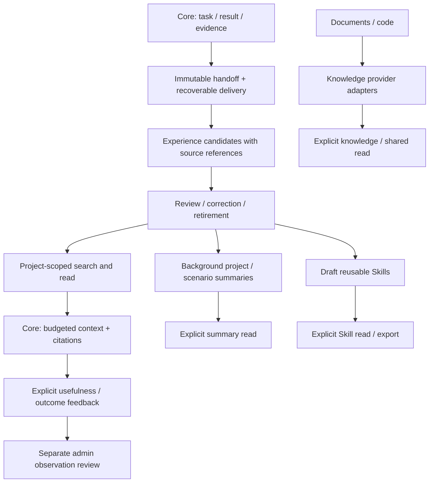
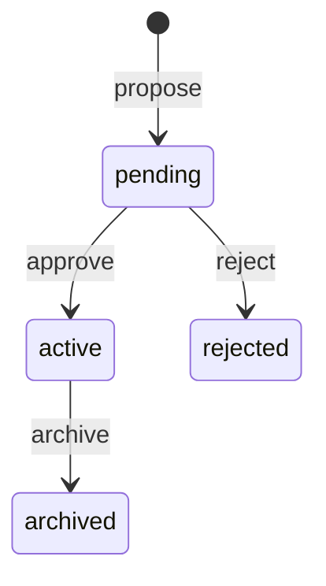

# ISEKAI Memory expansion architecture

Status: staged implementation. See the progress ledger for M0–M6 local acceptance
and deferred production extensions. M1 below is the historical baseline, supplemented by the
lifecycle, retrieval, offline generation, native Skill and [team asset](memory-team-assets.md) contracts. Semantic
model providers and automatic installation are not implied by completed local baselines.

## Product boundary

ISEKAI Memory will preserve execution evidence and turn selected experience into
reusable, attributable knowledge. Core owns execution, context assembly, policy
enforcement and artifact installation. Memory owns persistence, retrieval,
experience lifecycle and generation jobs. The handoff lease remains a delivery
contract; reading knowledge never consumes a handoff or acquires a lease.

This design draws on the local TencentDB-Agent-Memory checkout `c387ea4`, plus
WeKnora and teamai-cli. It adapts their patterns to PostgreSQL and ISEKAI's trust
boundaries; it does not copy their runtime, proxy, prompts or source code.



## Capability units and references

| Unit | Pattern to absorb | ISEKAI adaptation | Milestone |
| --- | --- | --- | --- |
| Source evidence | Tencent L0 and generation provenance | Existing immutable Task/Result envelopes; source ID and digests on every derived memory | M1 |
| Atomic experience | Tencent L1 facts, constraints and procedures | Typed project experiences, independently retrievable without claiming work | M1 |
| Governance | WeKnora pending/active and manual correction | Every initial proposal is pending; admin review, expiry, event receipts, then revision/suppression | M1–M2 |
| Retrieval | Tencent keyword/vector/RRF and bounded recall | PostgreSQL lexical baseline, then measured hybrid retrieval behind a provider contract | M1–M3 |
| Context | Tencent L3 + L2 index, details on demand | Core requests a small project snapshot and searches details; preserves classification and citations | M3–M4 |
| Consolidation | Tencent incremental L1/L2/L3 runners | Durable PostgreSQL jobs, source watermarks, replay-safe generation and explicit invalidation | M4 |
| Skill assets | Tencent extraction, versions, resources and bindings | Reviewed Skill drafts with triggers, steps, evidence and validation; publish through existing artifact workflow | M5 |
| Team learning | teamai Git documents and usefulness signals | Versioned export/import, explicit feedback distinct from recall count | M5–M6 |
| Knowledge and sharing | Tencent Wiki/CodeGraph and asset ACLs | Provider adapters and explicit sharing grants; authority checked before retrieval | M6 |

Reference code, relative to this repository:

- `../tencent/TencentDB-Agent-Memory/MemoryCore/src/core/record/l1-extractor.ts`
- `../tencent/TencentDB-Agent-Memory/MemoryCore/src/core/record/l1-dedup.ts`
- `../tencent/TencentDB-Agent-Memory/MemoryCore/src/core/tools/l1-candidate-recall.ts`
- `../tencent/TencentDB-Agent-Memory/MemoryCore/src/utils/pipeline-factory.ts`
- `../tencent/TencentDB-Agent-Memory/MemoryCore/src/core/skill/skill-core.ts`
- `../tencent/TencentDB-Agent-Memory/MemoryCore/src/gateway/knowledge-schemas.ts`
- `../tencent/TencentDB-Agent-Memory/MemoryProxy/src/injection/index.ts`
- `../tencent/WeKnora/internal/application/service/memory/service.go`
- `../tencent/teamai-cli/src/recall.ts`

## Invariants

1. Source integrity is not factual truth. A digest proves the saved relationship;
   it does not prove that a result, extracted statement or generated Skill is correct.
2. Delivery and knowledge have separate lifecycles. An acknowledged or expired
   handoff can be a retained source; a knowledge read does not change handoff state.
3. A project token cannot name another project. Classification filters narrow
   output, but are not security clearances: current tokens authorize an entire
   project. Personal/team ACLs and token clearance need an explicit later migration.
4. Derived classification cannot be lower than its sources. M1 inherits it exactly.
   Multi-source summaries must inherit the highest classification.
5. Pending, rejected, archived and expired memories never enter normal retrieval.
   Review access is a separate admin interface. Reference text never gains execution
   authority, permission to run tools or the status of a Foundation policy.
6. Content and source attribution are immutable in M1. Corrections use a new
   proposal; retirement of the old item is explicit. M2 adds atomic supersession.
7. Generation is outside handoff transactions and outside the context read path.
   A provider outage must not corrupt source evidence or acknowledge unfinished work.
8. LLM output is a proposal. Auto-activation, if later introduced, must be an
   explicit project policy evaluated against a quality dataset.
9. Skill export produces data for review. Installation or execution stays with Core
   and the existing artifact verification/release workflow.
10. No default collection of complete LLM traffic. New capture sources require
    explicit configuration, minimization and deletion semantics.

## Module boundaries

```text
handoff/       existing immutable task delivery and leases
experience/    source-backed proposals, review lifecycle, search/read service
retrieval/     M3 provider capabilities, lexical/vector results and rank fusion
generation/    M4 durable jobs, extraction, consolidation and provenance
skills/        M5 draft Skill schema, revision and export
team/          M6 pushed knowledge, exact-version grants, quarantine and feedback
server/        MCP contracts, authorization and transport
store/         shared PostgreSQL pool and existing handoff persistence
```

M1 keeps experience persistence in `experience/repository.py` and its tool schemas
in `experience/tools.py`, avoiding further growth of the handoff query module.
Do not introduce a universal asset superclass before multiple implemented asset
types need one. Identity and source contracts can later be shared explicitly.

## M1 contract

Migration `004` adds `memory_experiences` and `memory_experience_events`.

An experience contains project, kind (`fact`, `decision`, `constraint`, `lesson`,
`procedure`), title, content, tags, status, lifecycle version, optional expiry,
author, source handoff, source digests and the source Lock snapshot digest.
The Lock digest describes provenance; it is not a guarantee of applicability to
a future Lock. A caller may request an exact source Lock filter.

The source must exist in the same project. The source's classification, unit,
attempt and digests are captured by the service, never accepted from the caller.
The source handoff is retained by a foreign key. This does not implement a full
source snapshot or a deletion/privacy workflow; source deletion is restricted
while experiences reference it.

| Tool | Scope | Behavior |
| --- | --- | --- |
| `memory_experience_propose` | write | Create an immutable pending candidate from an existing handoff |
| `memory_experience_list` | admin | Paginate the review queue or other lifecycle states |
| `memory_experience_review` | admin | Approve/reject pending items, or archive active items, with expected version |
| `memory_search` | read | Return ranked, bounded excerpts of active, unexpired experiences |
| `memory_read` | read | Read one active, unexpired experience and its source attribution |

Proposal idempotency is scoped to `(project_id, actor_id, idempotency_key)`.
The same normalized submission replays the original identity; different content
under the same key conflicts. Replaying a proposal never reactivates it.

Review events are committed atomically with state changes. An event records actor,
action, previous and applied version/status. An identical actor/action/version
retry returns the original event acknowledgement even if a later transition has
happened. This receipt is not a statement of the current memory status. Competing
or stale transitions conflict. Approving an expired candidate is forbidden.

The review state machine is:



Expiry is an independent read/approval condition, not a background state mutation.
Omitted expiry means indefinite retention until explicit retirement. M1 contains
no purge job. List uses bounded offset pagination; it is not a frozen snapshot.

Search uses PostgreSQL `simple` full-text ranking plus an all-term substring
fallback for Korean and other text without stemming. This is not BM25, vector
search or a claim of semantic equivalence. Query length, term count, result count,
excerpt size, serialized result-character budget and SQL timeout are bounded.
Results are filtered by project, status, expiry, requested classification ceiling,
and optional kind/source Lock before ranking and limiting. Read uses the same
visibility conditions. The default classification ceiling is `internal`.

## Staged delivery and acceptance

| Milestone | Work and dependencies | Completion evidence |
| --- | --- | --- |
| M0: architecture | Boundaries, source mapping, contracts and milestones | This document and an actionable progress ledger |
| M1: governed experience | Additive schema; proposal/review; search/read; existing MCP transports | Real PostgreSQL migration and authenticated round trip; concurrent retry/review; project isolation; pending/expiry/classification exclusion; legacy handoff tests |
| M2: correction and lifecycle | M1; immutable content revisions, supersession links, rejection fingerprints, explicit validity and purge policy | Old content excluded after correction; stale writers fenced; rejected evidence not repeatedly proposed; deletion tests |
| M3: retrieval and Core consumption | M1–M2; provider interface, hybrid option, source-bound citations, budgeted Core adapter | Korean/English judged queries; relevance and latency comparison; permission filtering before top-K; Core offline fallback and context budget tests |
| M4: automatic extraction and summaries | M2–M3; PostgreSQL job claims, retries/dead letters, source watermark, model/prompt version, project/scenario snapshots | Restart/crash replay; no lost sources; generation cost budgets; summaries invalidated by corrections; no pending data promoted silently |
| M5: reusable Skills | M2 and M4; candidate detection, trigger/steps/validation schema, resource digests, review/version/export | Source-linked draft generated from validated work; hostile content treated as data; deterministic export; existing artifact verifier accepts reviewed package |
| M6: knowledge and team assets | M3 and M5; Wiki/code providers, asset grants, Git exchange, outcome feedback, administration | Cross-project denial including cache; grant revocation; source drift; import conflict handling; recall count cannot act as approval |

Core and dashboard implementation belongs to their own repositories. Their
contracts can be prepared here; changing them is a later delivery unit. M1 adds
server capability without altering Core's existing handoff selection or traffic.

## Measurement and rollout

Keep execution reliability and memory usefulness as separate measures. First
record project/scope denial, claim/review conflict and retry behavior. For M3,
establish a versioned, synthetic Korean/English dataset of decisions, constraints,
failure lessons and intentionally irrelevant/expired/rejected items; record
Recall@K, ranking quality, prompt characters and p95 latency before adding vectors.
For M4–M5 measure proposal acceptance, incorrect promotion, duplicate rate,
generation cost, source coverage and successful Skill reuse. Do not reuse Tencent's
published benchmark numbers as evidence for ISEKAI.

Deploy additive migrations explicitly. Existing clients continue to call their
existing nine tools; new tools are opt-in calls, with no automatic promotion or
LLM calls. Clients must tolerate additional advertised tools. Rolling back `004`
deletes experience/event data and requires backup and an explicit operator action;
it does not change handoff payloads or delivery receipts. M2 is specified in
[memory-lifecycle.md](memory-lifecycle.md); migration `005` rejects rollback when
M2 revision/forgetting/valid-from data cannot be safely represented by `004`.
